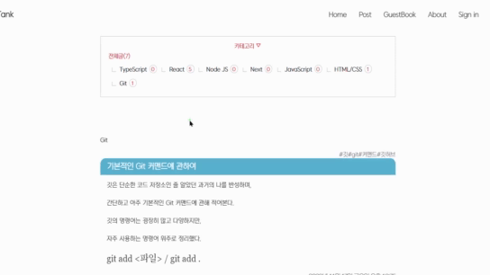

# My Blog

## Think Tank

Consist of React & Node JS
 
마이블로그 프로젝트는 MERN 스택을 활용,
직접 운영할 블로그를 만들기 위해 시작되었으며
MVC패턴으로 리액트와 노드 JS로 구성되었습니다.
 

[구경하기](https://www.kormelon.cf/)

---

## Stack

-   [x] MongoDB
-   [x] Express
-   [x] React
-   [x] Node JS
-   [x] Sass/Scss
-   [x] Babel
-   [x] Hooks/Redux

## DEPLOY

-   [x] Heroku
-   [x] Netlify

---

## Features

#### In Common

-   <a href="#passport" style="color:black">Passport&Jwt : 회원가입 및 로그인</a>
-   <a href="#hashtag" style="color:black">HashTags : 해시태그 합계 및 검색</a>
-   <a href="#view" style="color:black">Today / Total : 페이지 방문자 IP 집계
     

#### Post

-   <a href="#category" style="color:black">Category : 포스트 카테고리</a>
-   <a href="#quill" style="color:black">React-quill : 포스팅을 담당하는 Rich Text Editor</a>
-   <a href="#pagination" style="color:black">Pagination : 게시글 페이지 넘버링</a>
-   <a href="#comment" style="color:black">Comment : 댓글 작성 (익명 가능)</a>
     

#### GuestBook

-   GuestBook : 방명록 작성 (익명 가능)
     

#### Search

-   <a href="#searchs" style="color:black">Search : 어디서나 제목, 본문, 태그 검색</a>

---

### <a id="hashtag" style="color:black">HashTags</a>

해시태그를 집계해 20개의 태그를 홈화면에 띄우고, 클릭 검색

-   태그를 집계하기 위해 reduce 함수를 사용

    

---

### <a id="passport" style="color:black"> Passport&Jwt </a>

회원가입과 로그인

-   Passport와 Jwt토큰 사용

   

---

### <a id="quill" style="color:black">React-quill</a>

실제 블로그처럼 포스팅을 하기 위한 리액트 퀼 에디터 적용

   

---

### <a id="pagination" style="color:black">Pagination</a>

React-Pagination 패키지

-   페이징 넘버링
-   클릭 시, 백엔드에 쿼리로 요청

    

---

### <a id="category" style="color:black">Category</a>

포스트별 카테고리, 클릭 시 카테고리로 필터링한 게시글 출력

-   클릭시, 백엔드에 쿼리로 요청

    

---

### <a id="comment" style="color:black">Comment</a>

코멘트 등록 기능

-   로그아웃 상태에서도 가능 (익명)

    

---

### <a id="searchs" style="color:black">Search</a>

어디서든 제목, 본문, 태그별로 검색

-   기본은 제목 검색

    

---

### <a id="view" style="color:black">Today/Total</a>

하루/총 방문자 수 집계

-   방문 ip를 저장하여 중복된 아이피는 집계되지 않음
-   request-ip사용
-   매일 지정 시간때 토탈 합, 투데이 초기화

   

---
