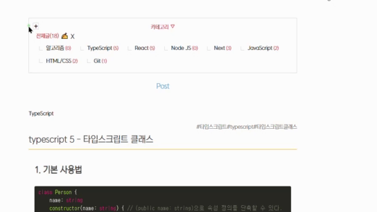

# My Blog - Think_Tank

[홈페이지](https://www.kormelon.cf/)

## Reason

#### Why?

마이블로그 프로젝트의 동기는 현재 운영 중인 네이버 블로그와는 별개로,  직접 블로그를 개발해 운영하고 싶은 욕구에서부터 출발하였습니다.

#### Info

이 블로그는 블로그에 있는 다양한 기능들을 대부분 지원합니다.

포스팅을 해시태그와 함께 작성하고 게시된 
포스트를 검색할 수 있으며 블로그 방문자 수가 집계됩니다.

카테고리를 임의대로 생성하고 수정하고 삭제할 수 있으며, 카테고리 별로 게시글을 볼 수 있습니다.

 
 

## Stack

**마이블로그는 다음과 같은 스택으로 구성되었습니다.**

1. 편안한 사용자 경험을 제공하고 동적 UI를 위한 <strong>React</strong>

2. 유저의 정보 등을 중앙에서 관리 하기 위한 <strong>Redux</strong>

3. 변수, 믹스인 설정 등 CSS의 효율적인 사용을 위한 <strong>Sass/Scss</strong>

4.서버 구축을 위한 Node.JS의 <strong>Express</strong>

5. 빠른 배포를 위한 <strong>Heroku&Netlify</strong>

 
 

## Structure

#### 주요 폴더 구조는 다음과 같습니다.

-   client/src/

    -   components
        -   **페이지 별로 보여지는 UI 컴포넌트**를 담당합니다.
        -   Layouts 폴더에선 **Nav나 Header, Footer 등 공통 레이아웃**을 관리합니다.
        -   Search 폴더 안 SearchBar.js 파일은 검색 기능 로직을 포함합니다.
        -   각 컴포넌트가 사용하는 Scss를 쉽게 확인하기 위해 동일한 이름으로 Scss파일을 설정했습니다.
    -   modules
        -   **리덕스 폴더**입니다. ducks패턴을 사용했습니다.
        -   유저 권한, 검색, 포스팅은 리덕스를 사용했습니다.
    -   pages
        -   라우터에 따른 페이지 폴더이며, **페이지 별 주요 로직**은 이곳에 있습니다.
    -   styles
        -   **공통된 스타일** 및 **믹스인과 변수, 애니메이션**들을 설정한 파일들이 있습니다.

 
 

## Features

-   <a href="#passport" >회원가입 및 로그인</a>
-   <a href="#hashtag" >해시태그 합계 및 검색</a>
-   <a href="#view" >페이지 방문자 IP 집계
-   <a href="#quill" >리액트 퀼</a>
-   <a href="#pagination" >파지네이션</a>
-   <a href="#category" >카테고리 생성/필터링</a>
-   <a href="#comment" >댓글 작성</a>
-   <a href="#searchs" >검색기능</a>

 
 

#### <a id="passport" style="color:black"> 회원가입 및 로그인 </a>

JWT 토큰 방식을 채택해 로그인한 유저를 인식합니다.

modules/auth에서 유저 정보를 저장합니다.

 

 

#### <a id="hashtag" style="color:black">해시태그 합계 및 검색</a>

해시태그를 집계해 20개의 태그를 홈화면에 띄웁니다.

Reduce 메서드와 Object.entries를 사용해 가장 많은 순서대로 태그를 정렬하였고, 클릭 시엔 포스트들을 조회할 수 있습니다.

 

 

#### <a id="view" style="color:black">페이지 방문자 IP 집계</a>

request-ip 모듈을 사용해 방문 ip를 저장하는 한편, 중복된 아이피는 집계하지 않습니다.

-   매일 지정 시간에 Total과 Today를 더하고, Today를 초기화합니다.

 
   
 

#### <a id="quill" style="color:black">리액트 퀼</a>

실제 블로그처럼 포스팅을 하기 위해 리액트 퀼을 적용했습니다.

해시태그도 임의로 입력할 수 있습니다.

 
   
 

#### <a id="pagination" style="color:black">파지네이션</a>

블로그의 게시글을 페이지 별로 구분해 볼 수 있도록  React-Pagination 모듈을 사용해 페이징 넘버링 기능을 구현합니다.

 
    
 

#### <a id="category" style="color:black">카테고리 생성/필터링</a>

 
카테고리를 임의대로 생성, 수정, 삭제하고 게시글에서 사용할 수 있게 합니다. 

 
    
 

클릭 시 카테고리로 필터링된 게시글이 출력됩니다.

 

#### <a id="comment" style="color:black">댓글 작성</a>

댓글을 작성할 수 있습니다.
 
<small>*로그아웃 상태에선 '익명'입니다</small>

 
    
 

#### <a id="searchs" style="color:black">검색 기능</a>

어디서든 제목, 본문, 태그별로 검색할 수 있습니다.

 
    
 
